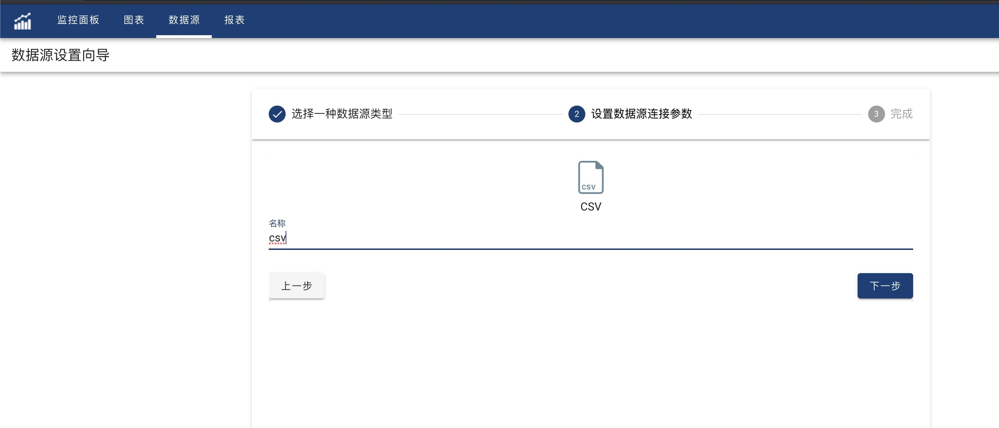
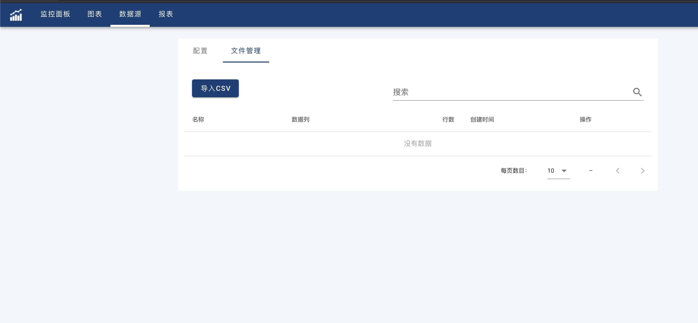

OhMyDash支持对CSV文件的导入和查询，这样您无需有Server也可以快速的开始您的工作。

#### 创建
在数据源列表页,点击+按钮打开数据源添加向导,选择CSV数据源,点击下一步,输入数据源名称例如csv,点击下一步,这样一个CSV数据源就创建好了. 



新建的CSV数据源没有任何数据,我们需要导入一些CSV文件到该数据源.点击返回数据源列表按钮,返回数据源列表页面. 点击刚刚创建的CSV数据源,进入数据源编辑页面,点击第二个Tab文件管理



在这个页面我们可以导入,删除和更新CSV文件.

#### 查询

CSV数据源使用JSON格式的查询文本查询CSV数据源. 格式为
```json
{
　　"name": "",                                  
　　"columns":[]                                 
}

```
其中name为CSV文件名,可在左边的数据源列表中选取, 该项为必填项.　columns是一个JSON数据，用来对CSV文件列进行过滤. 该列为可选项，默认选择CSV文件的所有列.
