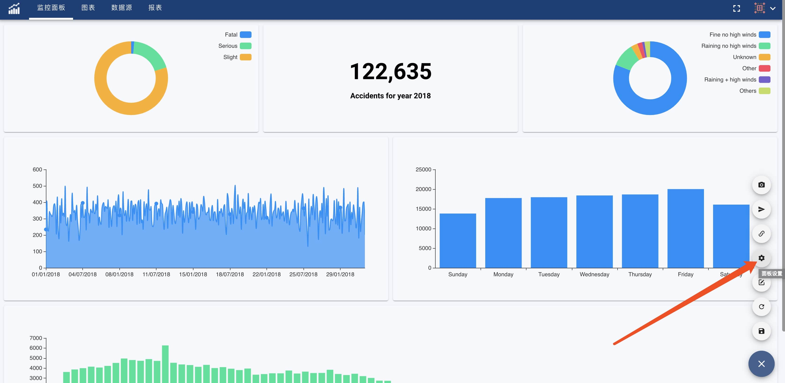
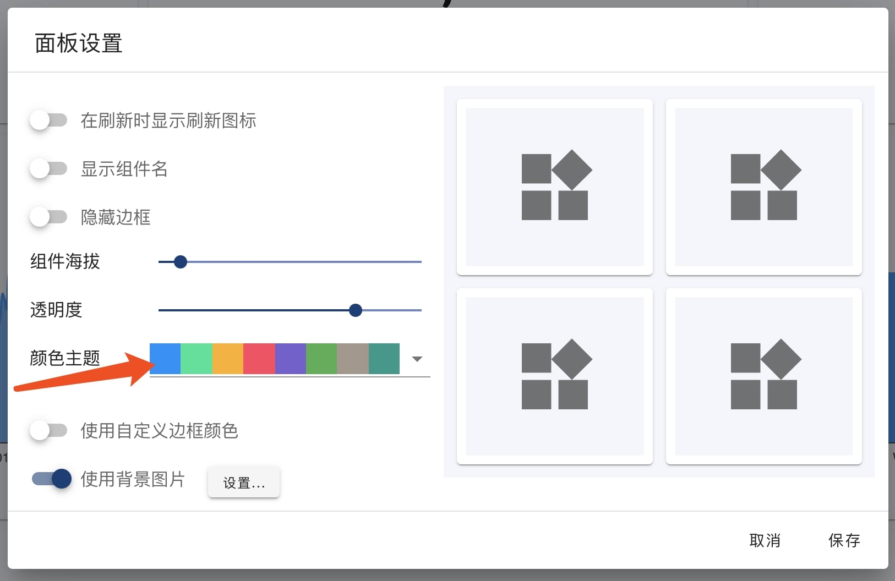
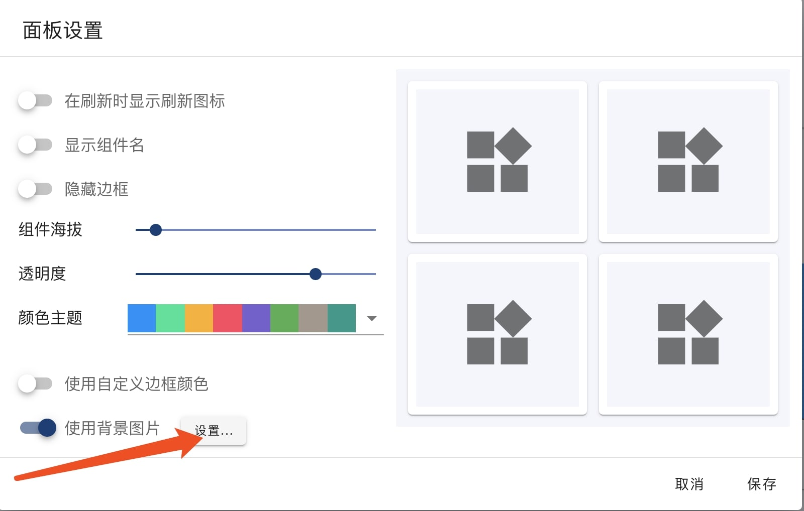

OhMyDash支持对监控面板设置来更改面板的边框、透明度、背景颜色、图表主题色等来改变监控面板的外观。设置监控面板可以打开设置对话框，如下图所示:

#### 图表颜色
选择颜色主题切换图表颜色。如下图所示:

!> 该颜色切换只对图表使用的颜色为系统提供的颜色有效，如果图表使用了自定义的颜色，则图表的颜色不会改变。

#### 背景图片
监控面板默认不使用背景图片，点击"使用背景图片"按钮，启用背景图片，点击"设置..."按钮，设置背景图片。如下图所示:

OhMyDash默认提供了一些背景图片供您使用，您也可以上传背景图片。

