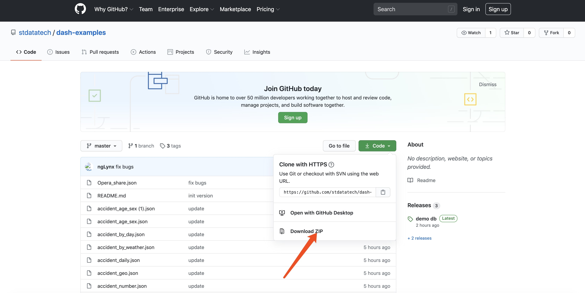

OhMyDash支持docker方式安装。使用OhMyDash的docker Image您可以快速体验OhMyDash的所有功能。

#### 前置条件
* 您已经安装了docker在您的电脑上，并正确配置。

#### 申请免费的License

在开始之前，你需要登录我们的网站 https://ohmydash.stdatatech.com/freeLicense 申请免费的License。 license会通过邮件发送给您的邮箱。点击邮件中的链接可以下载license文件。

#### 启动程序

```shell
docker run -d -p 3000:3000 stdatatech/ohmydash-lite
```
上面的命令运行成功之后，您可以通过 http://localhost:3000 来访问OhMyDash。 默认的用户名和密码为admin/admin.

#### 导入License

登录OhMyDash之后,进入页面http://localhost:3000/system_status 选择License Tab,你可以点击”升级许可证“按钮来导入刚刚下载好的license文件。导入License成功之后，您就可以开始使用OhMyDash了。

#### 使用测试数据

* 下载测试数据

您可以从 https://github.com/stdatatech/dash-examples/releases 下载最新的sqlite数据库文件demo.db.gz。Linux或者Mac下面执行下面的命令解压，Windows上请使用解压工具解压。
```shell
  gzip -d demo.db.gz
```
解压之后您将获得一个demo.db的文件，然后创建sqlite数据源,步骤可[参见](sqlite)

!> 请创建名称为demo的数据源，这很重要，将来导入图表的时候，会根据这个数据源的名称和类型进行自动绑定，这会省去您很多时间。

* 下载图表

您可以到github https://github.com/stdatatech/dash-examples 上下载我们为测试数据创建好的图表并导入进去。 如下图所示:



下载完毕之后，解压，您将看到很多json文件，这是您要导入的图表。导入图表见[导入/导出](imexport)