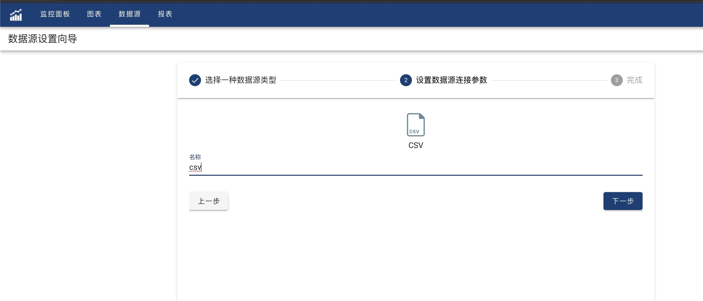
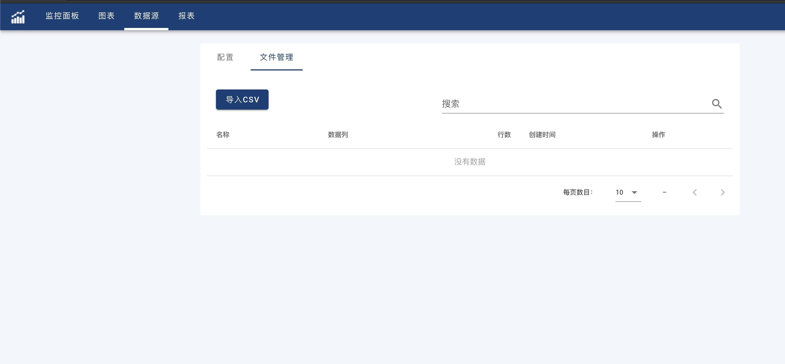

OhMyDash supports CSV file import and reference. It is very easy to quickly start data visualization task.

#### Creation
1. Click '+' on the top right of data source list to open 'Datasource Wizard'.
2. Select 'CSV', and then input a string as new CSV data source name, click 'Next'.



New created CSV data source has no data. Click 'Back to Datasource Page' and then click the new created CSV data source to manage CSV file in the 2nd tab, 'File Management'. 



In this page, user can import, delete and update CSV files for current CSV data source.

#### Reference

After creating a chart, select a CSV data source from left side data source drop down list. All imported CSV files in that CSV data source will be listed to be candidate data.

Use JSON format query statement to reference data from the selected CSV data source.

The JSON format:

```json
{
　　"name": "",                                  
　　"columns":[ "column1", "column2", ... ]                                 
}

```

In the JSON query statement, 
- **"name"** is mandatory which point to one of the CSV file name in the data source.

- **"columns"** is a JSON array which used to define required columns to be referenced into the chart from the selected CSV file. "columns" is optional. 

Default (Leave columns as empty array) will use all available columns from the CSV file.