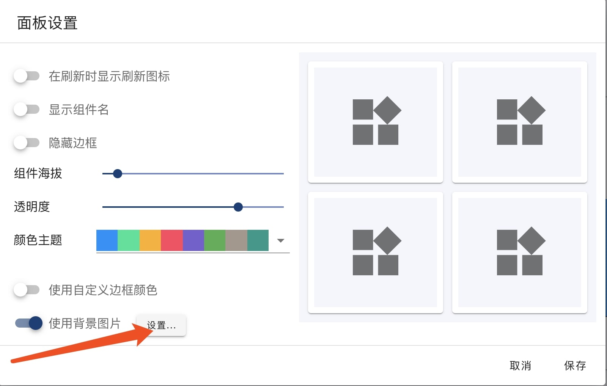

OhMyDash supports configuring border, transparent, background color, dashboard theme from Dashboard control panel to change dashboard appearance. 

#### Chart Theme
Select color theme to change chart color:

!> This setting only affect charts which applied with system default color. If chart is applied with customerized color, the setting will not affect it.

#### Background Image
Dashboard doesn't have any background image by default. 

Toggle 'Enable Background Image' to enable background image for current dashboard.

Click 'Set...' to select background image to be used.

OhMyDash provides a few default background images. User can also upload customerized images as background.

