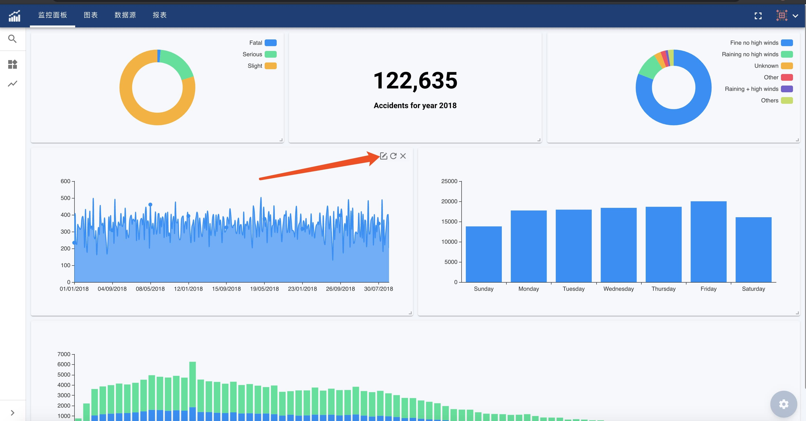
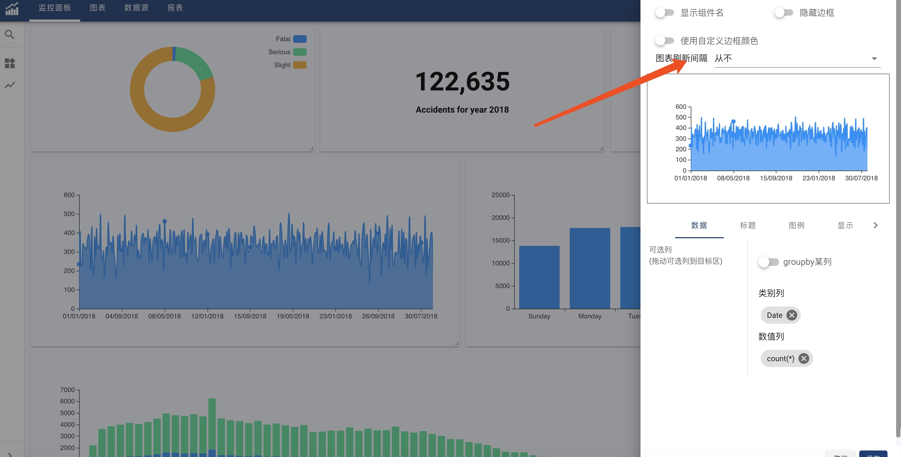

#### Chart Auto-Refreshing
Chart auto-refreshing is a common and useful feature for Dashboard.
OhMyDash support to set refresh interval for each chart.

* Switch dashboard to 'Edit Mode'. See [Mode](dash-mode)
* Hover on top right corner of a chart to show chart setting button:
  
  

* Setting refresh interval:

  
