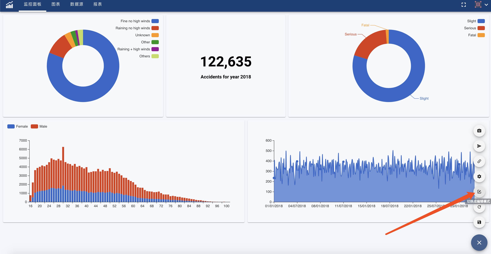
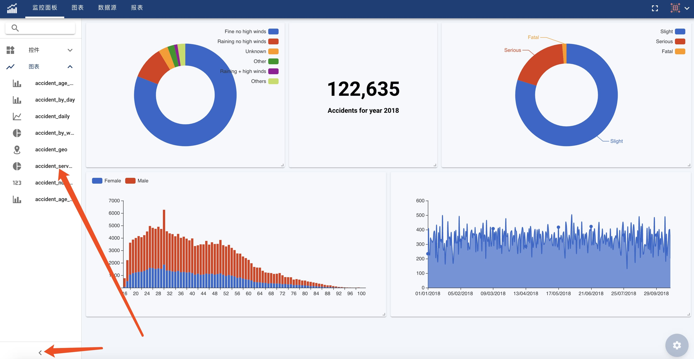

Two different modes are supported for Control Panel: Edit mode and Presentation mode.
Click 'Switch Mode' button to swith between the two modes.

#### Edit Mode
  User can drag and drop charts to add, remove, move, resize charts or widgets in Edit mode.
  
  Chart and Widget Inventory is on the left side of page.
  Edit area is on the right side of page.

Click 'Switch Mode' button after editing to switch back to Presentation mode.