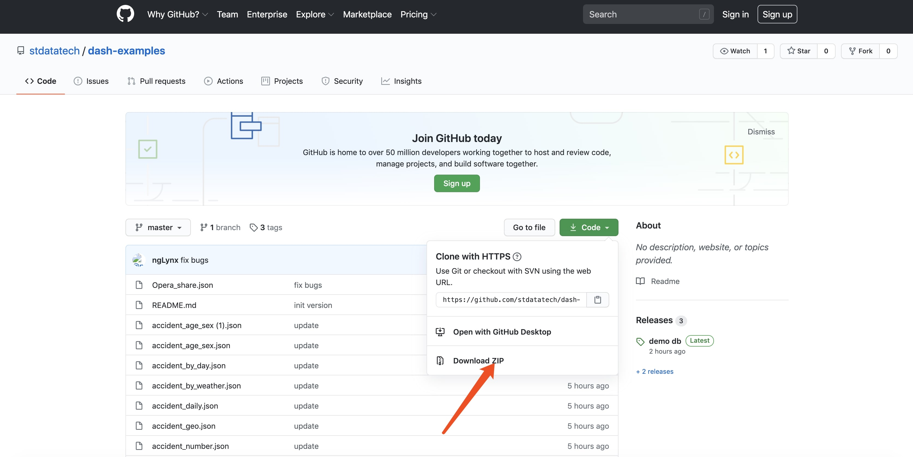

OhMyDash support installation base on docker image. User can experience all OhMyDash features by installing OhMyDash docker image.

#### Prerequisite
* Docker Engine has installed and configured.
* User has docker hub account and has granted access to image.
* User login into docker hub.

#### Getting Started

* First usage on *nix

OhMyDash container can use mounted volume to store user data into local disk, such as system settings, user preference, chart definition, dashboar definition, etc. These data will not lost when user try to launch new OhMyDash container with new image.<br>

The following sample shows how to use local /tmp/ohmydash to keep user data.
```shell
docker run -d -p 3000:3000 -v /tmp/ohmydash:/opt/ohmydash/u-data stdatatech/ohmydash /opt/ohmydash/bin/start.sh
```

When above docker command executed successfully, user can OhMyDash start page by accessing to http://localhost:3000 via any WebBrowser. Default user password is admin/admin. <br>

A Free License is shipped when running OhMyDash in docker with limited features. You can contact us to acquire a full-feature license.

* List running OhMyDash containers

```shell
docker container ls | grep stdatatech/ohmydash
```
```shell
docker container ls --all | grep stdatatech/ohmydash
```

* Stop OhMyDash

```shell
docker stop <your container ID>
```

* Restart OhMyDash
 
```shell
docker start <container ID>
```

* Upgrade OhMydash

```shell
docker run -d -p 3000:3000 -p 8080:8080 -v /tmp/ohmydash:/opt/ohmydash/u-data stdatatech/ohmydash /opt/ohmydash/bin/start.sh <your ipaddress> 8080 
```

#### Use Sample Data

* Download Sample Data

User can download latest sqlite database file demo.db.gz from https://github.com/stdatatech/dash-examples/releases. <br>

Execute the following command on Linux or Mac to extract demo database
```shell
  gzip -d demo.db.gz
```
Use any available extract tool on Windows to extract demo database.

User can create sqlite database source after get demo.db file. [Reference](sqlite)

!> Please create a new sqlite datasource which name with 'demo'. 'demo' is the default name of sample charts and dashboard. It would be easy for user to see sample charts and dashboard when import sample charts and dashboard.

* Download Sample Charts and Dashboards

User can download predefined sample charts and dashboard from github https://github.com/stdatatech/dash-examples



After download and extract sample charts and dashboard definition, user will have a bunch of json files. Please reference to [Import/Export](imexport) to import charts and dashboard samples.