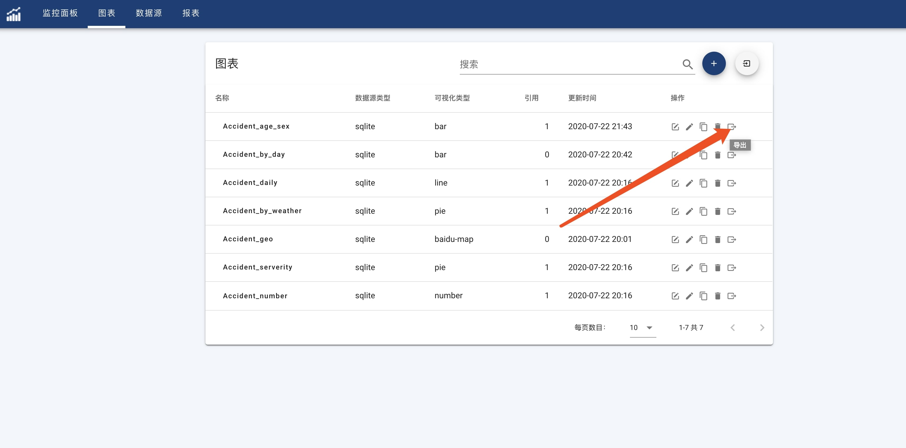
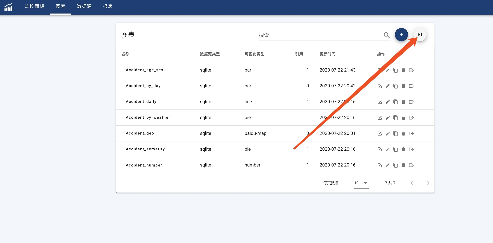

#### Export Charts

Select 'Chart' to open Chart list page.
Click 'Export' button in 'Action' column to export selected chart.

!> Chart will be exported into JSON file to persistent chart setting and datasource configuration without real data.

#### Import Charts

Select 'Chart' to open Chart list page.
Click 'Import' button on top right corner of chart list to import chart json files.

!> User can import multiple files together. Each imported json file will be used to create a new chart. New imported charts will try to bind with default exported datasource according datasource type and name. If no matched datasource is found, then user needs to bind datasource for chart manually.
