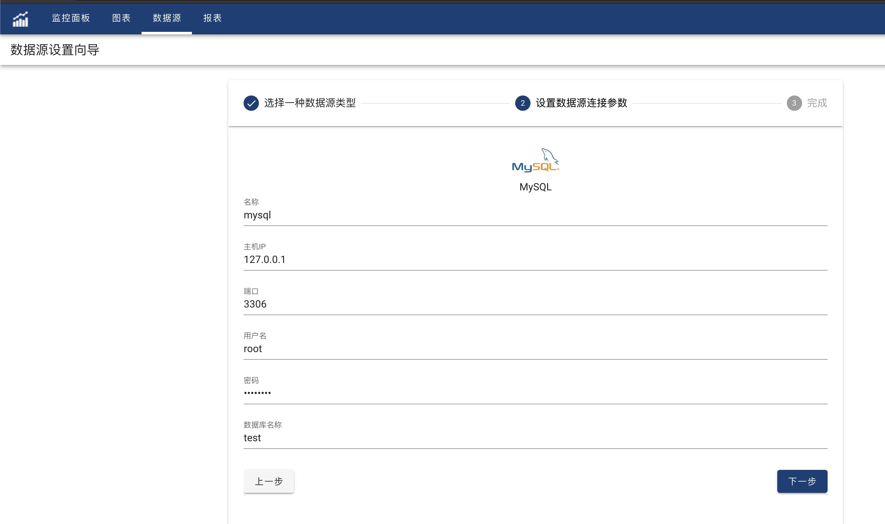

OhMyDash support to use JDBC to connect data source, including MySQL, MS SQL Server, DB2, Oracle, Postgres, Clickhouse, etc. 

User can follow datasource wizard steps to configure new JDBC datasource parameters, such as host, user name, password and database name, etc. 

When user click 'Next', system will test connection parameters to verify all database settings. If database is available by using the given parameters, wizard will indicate datasource is created success. Otherwise an exception message will be popup to warn user that some parameters are wrong.

