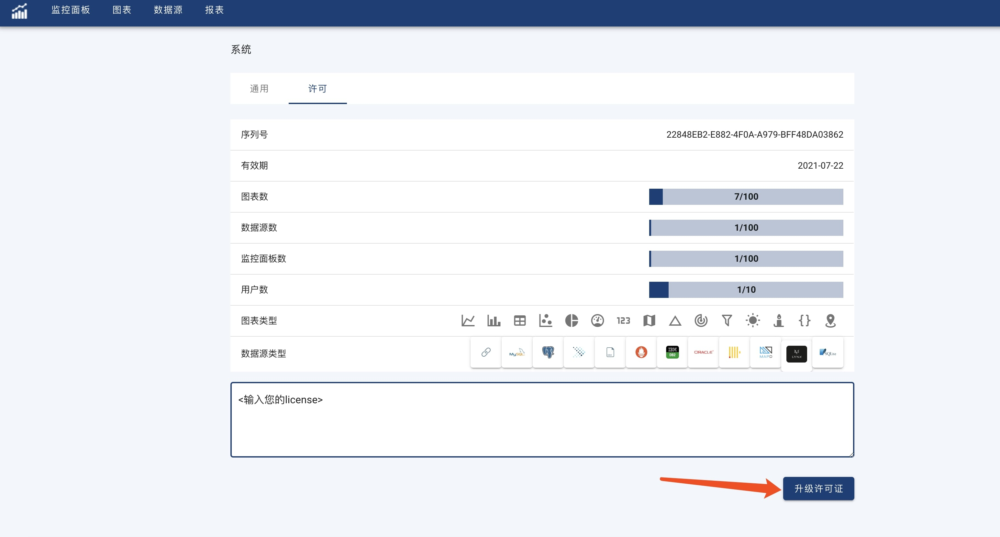

#### Update License

Click 'User Account' -> 'System', Select 'License' Tab.  
Paste user license into License Input Area, and then click 'Update License'.  
If the provided license is valid, License page will be updated to show all supported features, users, etc.

