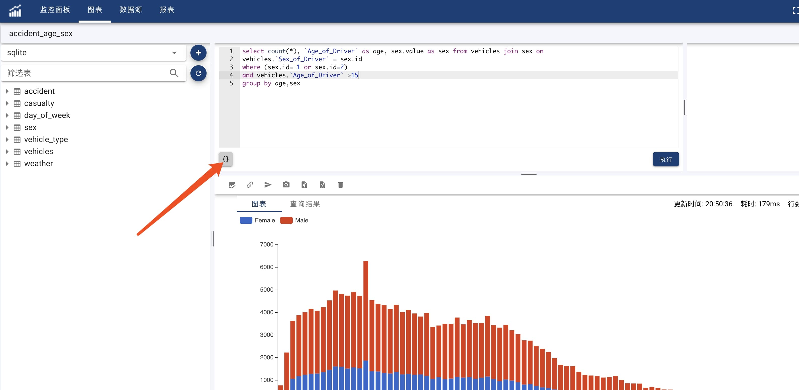
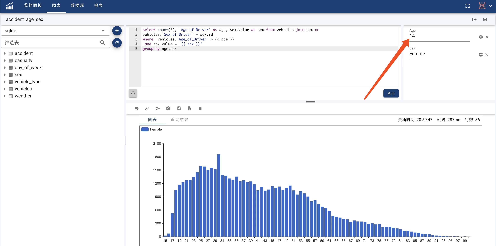

#### Parameters
OhMyDash support to define parameters in chart definition. By changing parameter values, user can interactive with chart to view different result under different conditions.

User can define parameters by following below steps：

* Open chart in edit mode
* Move curse to the place where plan to have parameter
* Click '{}' button on bottom left of query edit area



For example, user has the following SQL query statement:
```sql
  select count(*), `Age_of_Driver` as age, sex.value as sex from vehicles join sex on 
    vehicles.`Sex_of_Driver` = sex.id
  where vehicles.`Age_of_Driver` > 15
  group by age,sex
```
The age and sex are the two values to define as parameters. <br>
To define query parameter, user must provide name, label, and parameter type. 
* Choose a proper type for a parameter
* Name parameter by using charaters which only contains [a-zA-Z_0-9] and can't start with digit.
* Label parameter with any meaningful text.
* Click 'OK' to complete paramete definition. 
* Confirm '{{ [parameter_name] }}' is located on the right position in the query statement.

Check the example of age and sex in the following query with parameters..
```sql
  select count(*), `Age_of_Driver` as age, sex.value as sex from vehicles join sex on 
    vehicles.`Sex_of_Driver` = sex.id
  where vehicles.`Age_of_Driver` > {{ age }} and sex.value = '{{ sex }}'
  group by age,sex
```
!> The second parameter is wrapped in single quote. This is due to OhMyDash only support simple replace, without data type detection. If parameter is not injected with right format, query statement may contains unexpected syntax errors.


#### Set Default Value
After defining a parameter, user can set default value for that parameter, dashboard will direclty take default value when rendering chart.
