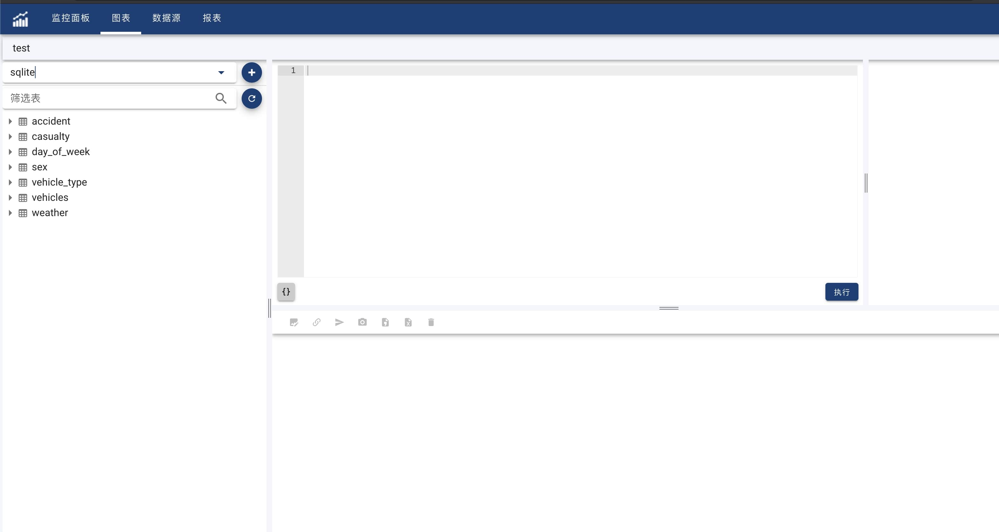
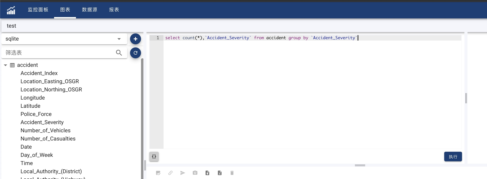
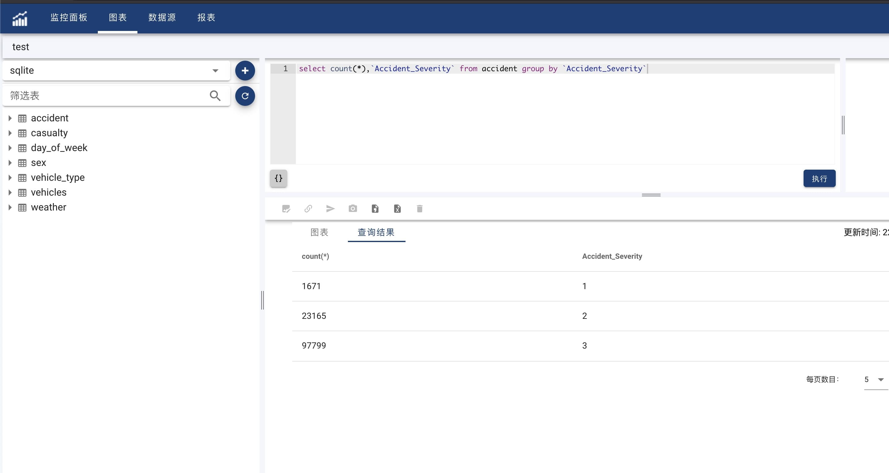

#### Query
Click 'Charts' menu, and then click '+' on the top right corner of chart list to create a new chart. 

Input a name for the new chart, and then click 'OK' to start editing chart.

Chart Editor has 3 parts: Data source area (Left), Query editor (Up Right), Data review (Down Right)

- Choose Data Source

Select one data source from source drop down list on the left side. If there doesn't have target data source, click '+' on the right side of drop down list to create a new one.

When data source is selected, data source area will show different meta-data according to selected data source. For instance, table, view and columns will be listed for RDBMS data source.

- Edit Query Statement

In Query editor area, query statement editor is on the left side. query parameter list is on the right side. 
In query statement editor, query language could be different according to selected data source, such as SQL for RDBMS and CSV for JSON, etc.
If there has no query parameter define in current query statement, query parameter list will be empty. 
When finish editing, click 'Execute' to run the query.

- Review Query Result

Data review area has one tool bar and two tabs.
First Tab is used to preview defined chart according to latest query result.
Second Tab is used to show latest query result in table mode for user to review query.
If there has no defined chart, there will have a indicator in first tab to reminde user define a new chart for current query.

