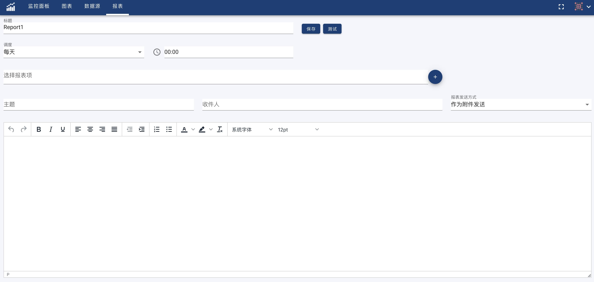

OhMyDash can send dashboard and chart to specified mail box as report email by following user configurations. Please configure Email [Notification](notification) correctly before start to use report feature.

Select 'Report' to navigate to Report page. Click '+', and then input new report name to start defining report.

- Set Send Interval
OhMyDash support to send report daily, weekly and monthly.

- Set Target Dashboards or Charts

OhMyDash can include one or more dashboard and chart as report target. They can be sent as mail content or attachment.

- Set Mail Subject, Recipients and Content

After filling above email settings, click 'Test' to send verification email. 
If everything works properly, click 'Save' to persistent these settings.
