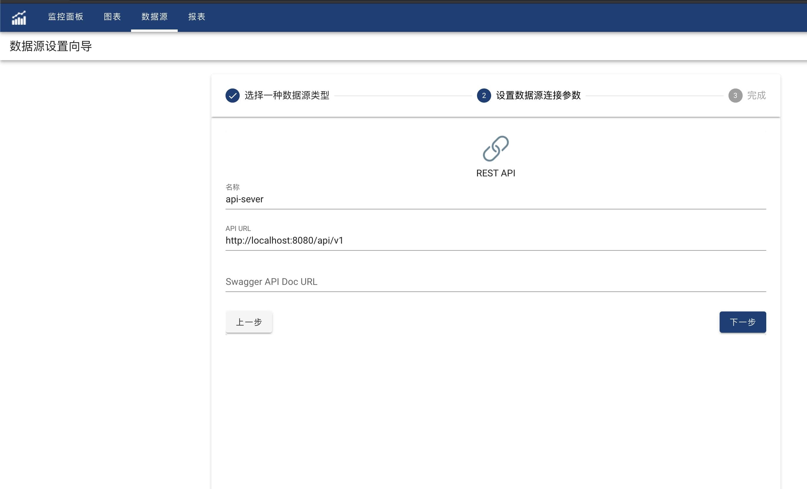

OhMyDash can read data through HTTP REST-API.

#### API Server
OhMydash requests REST-API server return data in JSON format. OhMyDash supports to use JSON Path mapping JSON response into OhMyDash required data format.

#### Creation
In Data source list page, click '+' to create a new data source. Select 'REST-API', click 'Next'.
Input REST-API data source name, API Server URL. Swagger API Doc URL is optional.



API Server's URL looks like **http(s)://server-host:server-port**. 
If all URLs start with **api/v1**, the URL could also be **http(s)://server-ip:server-port/api/v1**
Click 'Next' to finish

#### Query
Use JSON format to query REST-API
```json
{
    "method": "",
    "url": "",
    "headers": {
    "http-header-name": "http-header-value"
    },
    "body": {
    
    },
    "columns": [
      {
        "name": "<your colomn name1>",
        "jsonPath": "",
        "defaultValue": ""
      },
      {
        "name": "<your colomn name2>",
        "jsonPath": "",
        "defaultValue": ""
      }
    ]
}
```
- method
Optional, only support 'GET' and 'POST', default 'GET'
- url
Mandtory, relative path to REST-API server URL.
For example, if the server URL is http://localhost:8080/api/v1, and the query request url is http://localhost:8080/api/v1/types, then the url here should be **types**.
- headers
Optional, support to have multiple http headers, such as Content-Type, Accept-Type, etc，
- body
Optional, rest-api request body, mostly required for 'POST' method

#### Example

There is a REST-API: http://some-api-server/getbooks which return the following JSON format data

```json
{
  "store": {
    "book": [
      {
        "category": "reference",
        "author": "Nigel Rees",
        "title": "Sayings of the Century",
        "price": 8.95
      },
      {
        "category": "fiction",
        "author": "Evelyn Waugh",
        "title": "Sword of Honour",
        "price": 12.99
      },
      {
        "category": "fiction",
        "author": "Moby Dick",
        "title": "Moby Dick",
        "isbn": "0-553-21311-3",
        "price": 8.99
      },
      {
        "category": "fiction",
        "author": "J. R. R. Tolkien",
        "title": "The Lord of the Rings",
        "isbn": "0-395-19395-8",
        "price": 22.99
      }
    ],
    "bicycle": {
      "color": "red",
      "price": 19.95
    }
  },
  "expensive": 10
}
```
The expected data would be accepted as a table.

|Title|Author |Price |Category |
|:-----|:----- |-----:|:-------- |
|Sayings of the Century   |Nigel Rees      |  8.95   |  reference|
|Evelyn Waugh   |Evelyn Waugh      |  12.99   |  fiction|
|Moby Dick   |Moby Dick  |  22.99   |  fiction|
|The Lord of the Rings   |J. R. R. Tolkien      |  19.95   |  fiction|

First, create a REST-API which use http://some-api-server/ as Base URL, and then reference it from a created chart
In the new chart query, define the following query statement in JSON format

```json
  {
     "method": "get",
     "url": "getbooks",
     "columns": [
       {
          "name": "Title",
          "jsonPath": "$.store.book[*].title",
          "defaultValue": ""
       },
       {
          "name": "Author",
          "jsonPath": "$.store.book[*].author",
          "defaultValue": ""
       },
       {
          "name": "Price",
          "jsonPath": "$.store.book[*].price",
          "defaultValue": "0"
       },
       {
          "name": "Category",
          "jsonPath": "$.store.book[*].category",
          "defaultValue": ""
       }
     ]
  }
```
Click 'Execute', if everything goes fine, data will be show as table in data review tab.