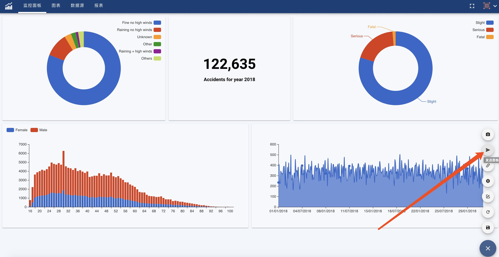
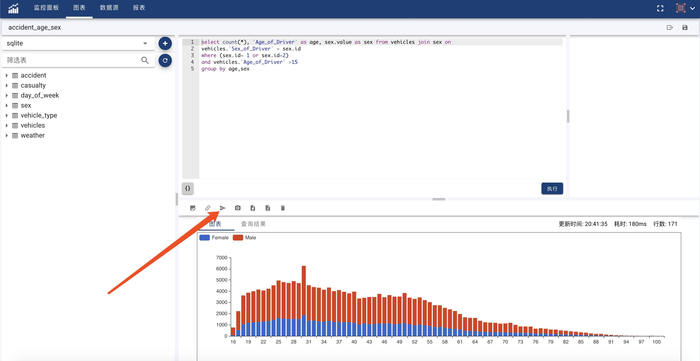
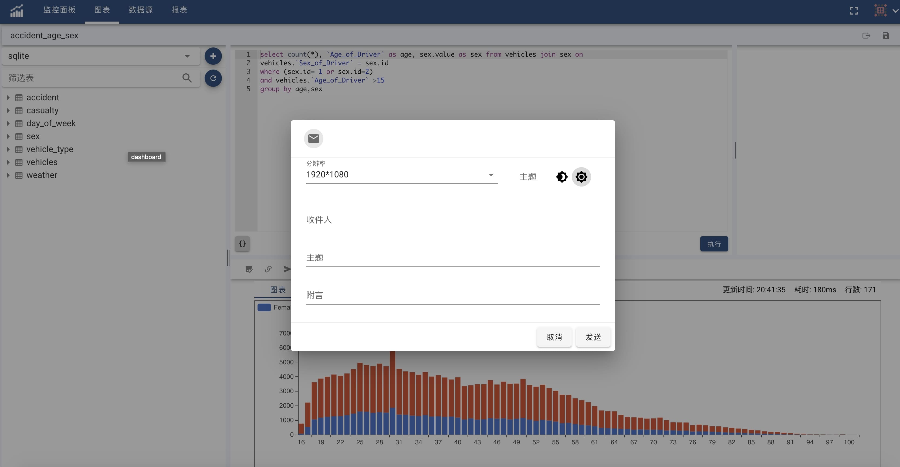

Dashboard and Chart can be share via Email, Facebook and Twitter to your colleagues.
Please configure [Notification](notification) before sharing.

Share Dashboard: 

Share Chart:

According to different share channel, Share Information would be different. For example, share via email:

Input the mail recipient, subject and a short message. Dashboard or Chart screenshot will be sent as mail attachment.