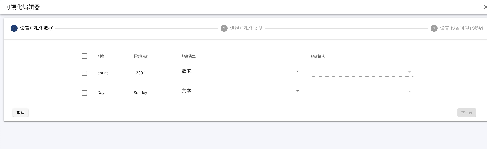

#### Visualization
- Data Mapping

Click 'Add' to start chart definition.

In this step, check required columns. Choose proper data type for each column if necessary. Define data format for number or time data. Refrence to [Format](format)

After data mapping, click 'Next'.

- Choose Chart Type

Select target chart type from supported chart list. Click 'Next'.

- Chart Edit

Chart editor will be different according to the selected chart type.
Chart parameter define is on left side. Chart preview is on right side.
User needs to define chart according to query data and chart type.

When finish chart definition, and chart preview shows expected visualization effect. Click 'Complete' to persistent chart definition.

#### Change Visualization for Query
Select target chart from Chart List to open Chart Editor
If current chart has no chart definition, click 'Add' to start Chart Definition Wizard.
If current chart already has chart definition, click remove button in chart tool bar, and then create a new chart with other chart type.

