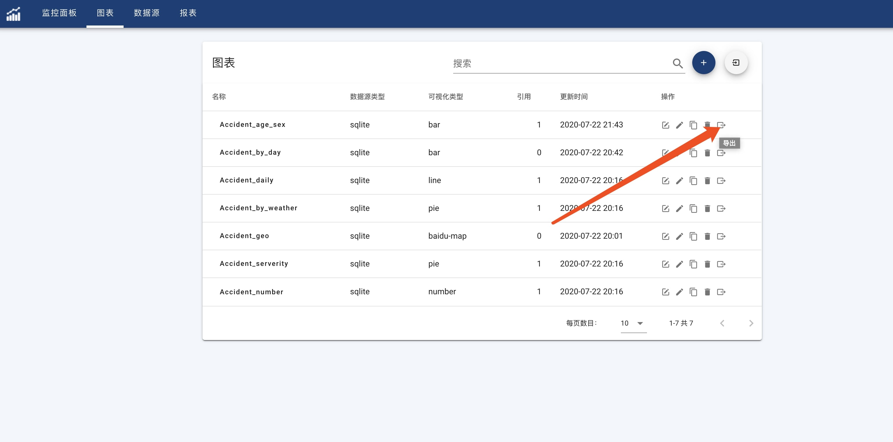
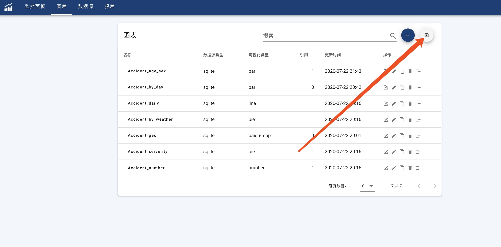

#### 导出图表
点击图表菜单进入图表列表页面，点击操作列导出按钮导出选择的图表。如下图所示:

!> 图表导出的文件为json格式的文件，图表导出并不会导出数据，只是导出该图表的配置。

#### 导入图表
点击图表菜单进入图表列表页面，点击搜索框旁边按钮，导入图表。如下图所示:

!> 可以同时导入多个文件。图表导入会创建一个新的图表,默认会根据导出时的数据源类型和名称进行自动匹配并连接数据源。如果没有找到匹配的数据源，需要手动设置该图表的数据源。
