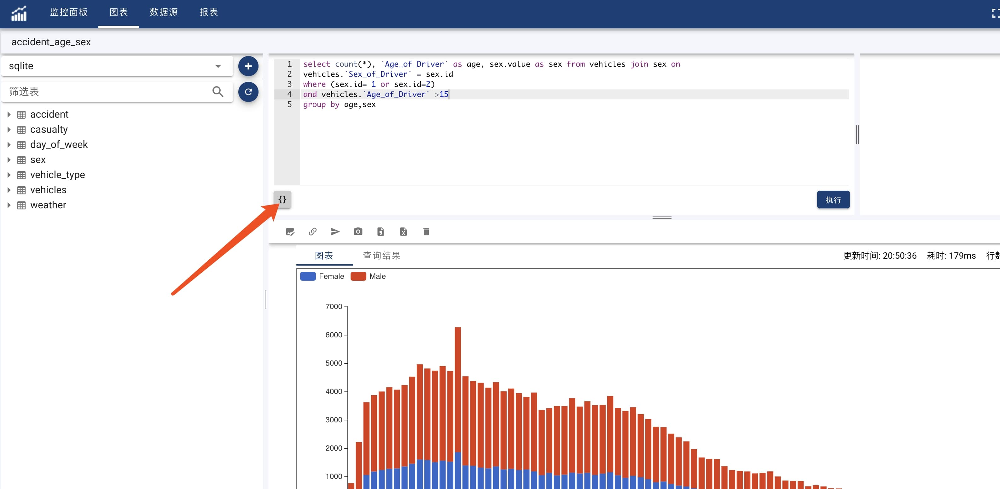
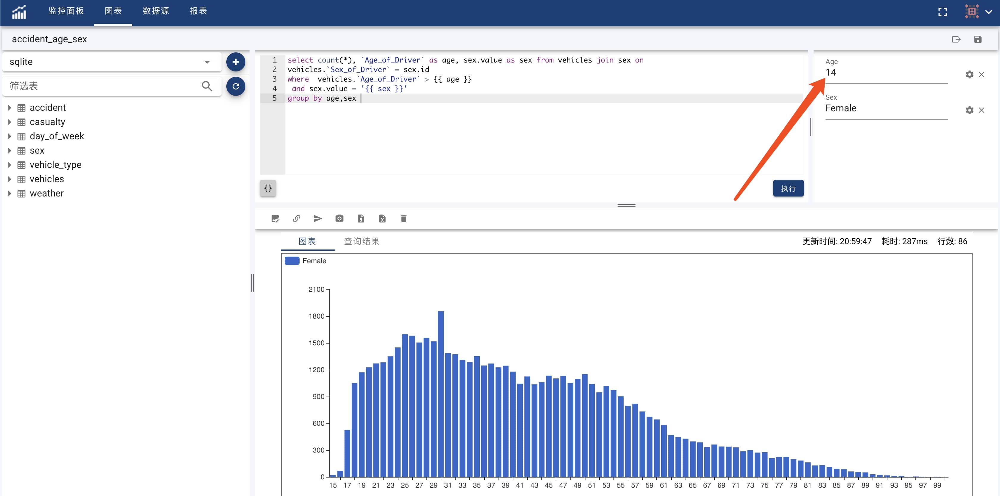

#### 参数
OhMyDash支持带参数的图表，通过带参数的图表，我们可以和图表进行简单的交互。
创建步骤如下：
* 新建或者进入某个图表编辑页面。
* 点击查询编辑区左下方的{}按钮插入查询参数。

如下图所示:


举例如下,假定您的查询文本为:
```sql
  select count(*), `Age_of_Driver` as age, sex.value as sex from vehicles join sex on 
    vehicles.`Sex_of_Driver` = sex.id
  where vehicles.`Age_of_Driver` > 15
  group by age,sex
```
你想对上面的查询设置查询两个查询参数age和sex。 因为Age为数值类型，所以首先添加数字类型的查询参数,例如命名为age。查询参数有name和label两个属性，label为显示的名称，您可以设定为任意的字符串，
name为查询参数的名字,只能是[0-9a-zA-Z_]字符，且不能以数字开头。 定义好之后，点击确定会在editor中插入 {{ age }} 字符。请把该字符串放置到合适的位置。 如下所示:
```sql
  select count(*), `Age_of_Driver` as age, sex.value as sex from vehicles join sex on 
    vehicles.`Sex_of_Driver` = sex.id
  where vehicles.`Age_of_Driver` > {{ age }}
  group by age,sex
```
添加第二个字符串参数。例如名为sex的参数。 点击确定之后会在editor中插入{{ sex }} 字符，请把该字符串放置到合适的位置。如下所示:
```sql
  select count(*), `Age_of_Driver` as age, sex.value as sex from vehicles join sex on 
    vehicles.`Sex_of_Driver` = sex.id
  where vehicles.`Age_of_Driver` > {{ age }} and sex.value = '{{ sex }}'
  group by age,sex
```

!> 该参数需要包裹在单引号内, OhMyDash只是简单的替换，不会感知数据类型。 上面的参数如果不放置在单引号内，会导致语法错误。
这样一个带参数的查询就编辑好了。

#### 设置默认值
添加好参数之后，在参数列表区，设置参数的值并保存，这些值将作为图表参数的默认值。Dashboard上该图表也将使用该默认值显示数据。
如下图所示:
