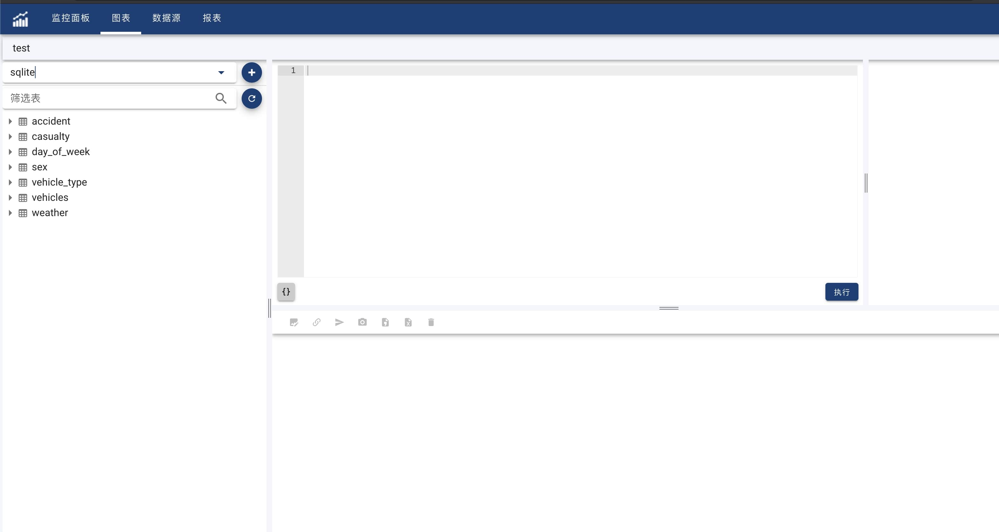
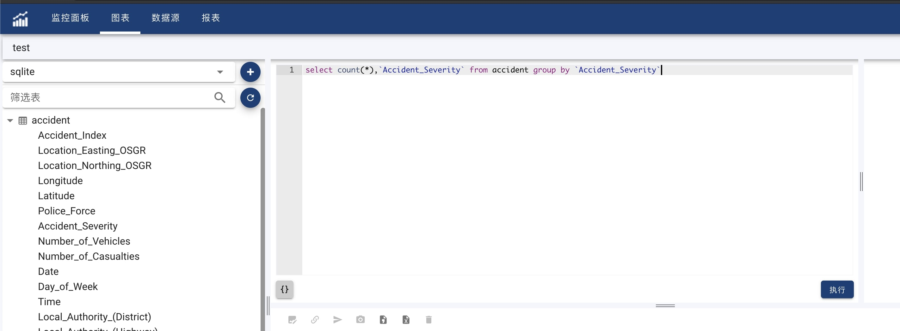
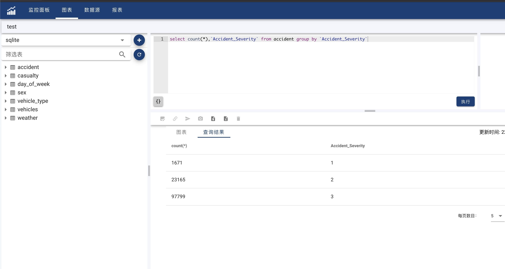

#### 查询
菜单栏点击”图表” 进入图表列表页面。点击表格右上角的 + 号按钮创建新的图表。按钮会弹出一个对话框, 在对话框中输入新建图表的名字，点击”确定”进去图表编辑页面。图表编辑页面分为3大部分。左边是数据源区，右上部分为查询编辑区，右下部分为图表区。
创建图表分为如下几步：
- 选择数据源

首先在数据源区最上面下拉框中选择数据源，如果下拉框中无数据，可以点击下拉框右边的+按钮创建数据源。选择数据源后，根据选择的数据源的不同，数据源区的下面部分会显示该数据源的元数据。例如对于关系型数据库，则会显示出该数据库中的所有表格和视图以及每个表格的数据列。有些数据源可能没有元数据，则不会显示。

- 编译查询文本

在查询编辑区的上面的左半部分为查询语句的编辑区。右半部分则为查询语句的参数区。有些查询没有参数，则参数区为空。查询语句的编辑区，根据选择的数据源的不同，查询语言的格式会有所不同，可能为SQL、JSON等。编辑完查询文本之后，点击运行。

- 查看查询结果

图表区分为工具栏和两个Tab。第一个Tab为图表，第二个Tab为查询结果的表格显示。运行的结果会在第二个Tab上显示。第一个Tab为图表。对于尚未创建的图表，第一个Tab的中间部分会有按钮提示你点击进行创建图表。

