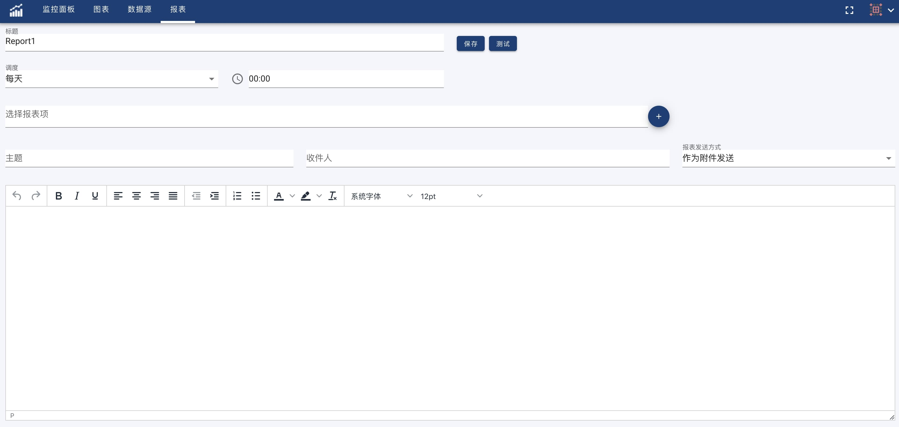

报表提供了定时发送Dashboard和图表到邮箱的功能。在使用报表功能之前，请先正确设置邮箱通知功能,参见[通知](notification).

在报表页面，点击+按钮，输入报表名称，创建报表，新建的报表如下图所示:

- 设置发送间隔

  OhMyDash支持按照每天、每周、每月发送报表。

- 设置报表发送项目。
 
  OhMyDash可以把一个或者多个Dashboard或者图表作为发送项，他们或作为报告的附件或者作为图片附件在正文的后面。

- 设置邮件主题及其收件人和邮件正文

完成上述设置之后，可以点击测试按钮，进行测试，如果邮箱设置正确，并且收件人中有您的邮箱，您应该会收到邮件，如果格式等没有问题，您就可以保存了，这样您就完成了报表的设置，所有该设置中的收件人应该会定期收到您的报表。
