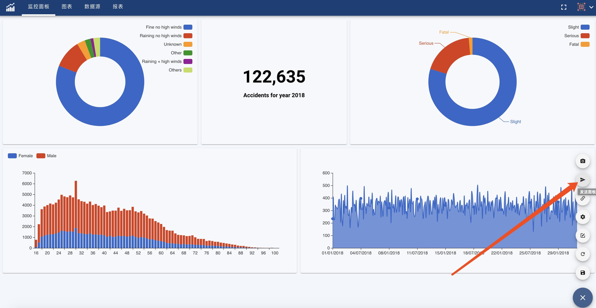
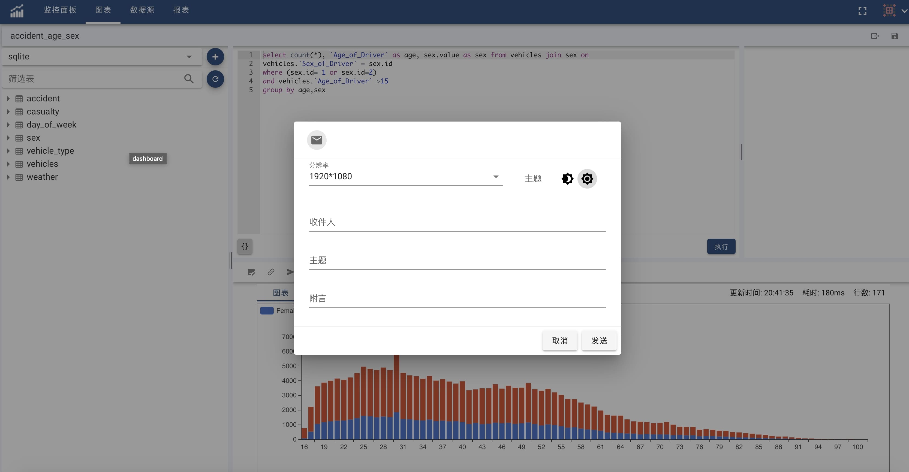

图表和监控面板的内容支持通过邮件、企业微信、钉钉等方式快速的发送给您的同事，进行分享。为了能够发送，请先配置系统支持邮件、企业微信和钉钉发送，参见[通知](notification)配置。

面板发送见下图:

图表发送见下图:

根据您上述通知方式配置的不同，发送对话框有所有不同。下图是邮件的发送对话框:

您需要设置收件人的邮箱，发送的主题，简短的附言。图表或者面板的截图将会作为邮件的附件发送到对方的邮箱中。