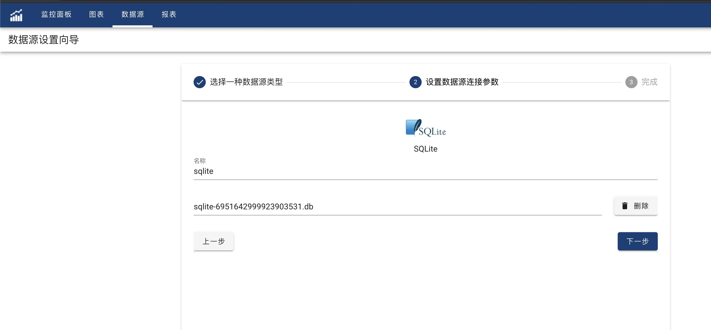

SQLite是一个文件数据库,与CSV类似我们可以把SQLite文件导入到系统中进行查询。

#### 创建

在数据源列表页面，点击+按钮进入数据源创建向导，选择SQLite数据源,点击进入下一步,SQLite数据源设置页面，输入数据源的名称，然后点击文件选择框，选择SQLite数据源文件，选择完成后，点击上传. 等待上传完毕之后，系统将会返回一个系统分配的数据源文件名，该文件名的格式为sqlite-\<id\>.db填充在文件输入框中. 点击下一步，一个SQLite数据源就创建好了.

