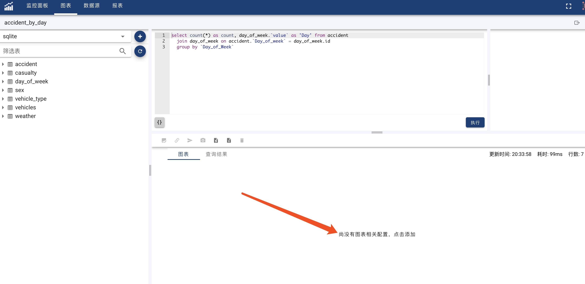
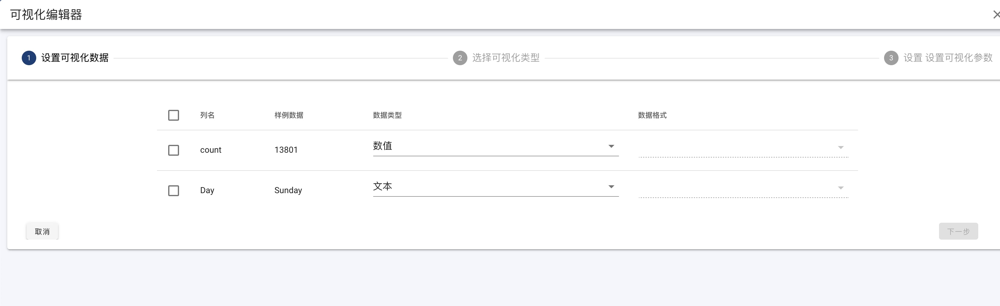
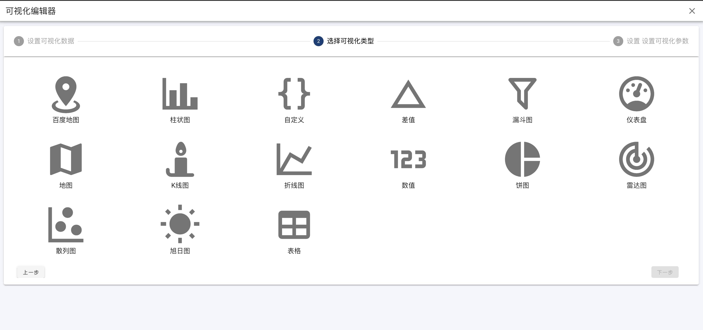
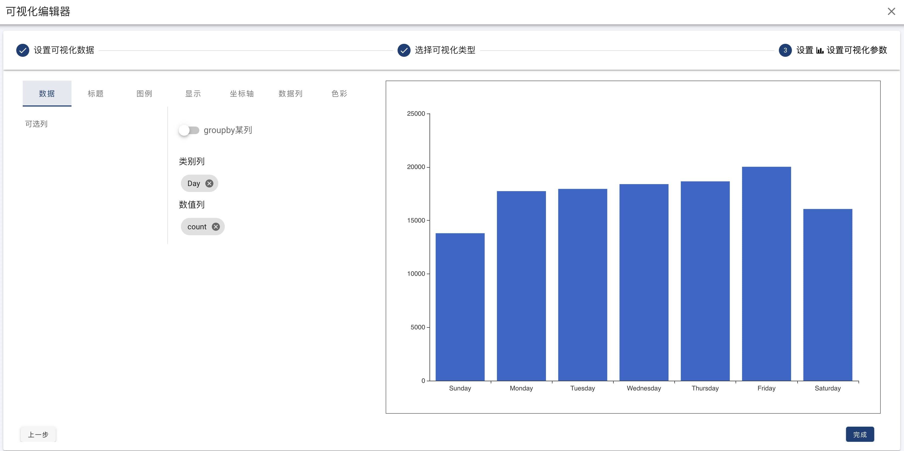
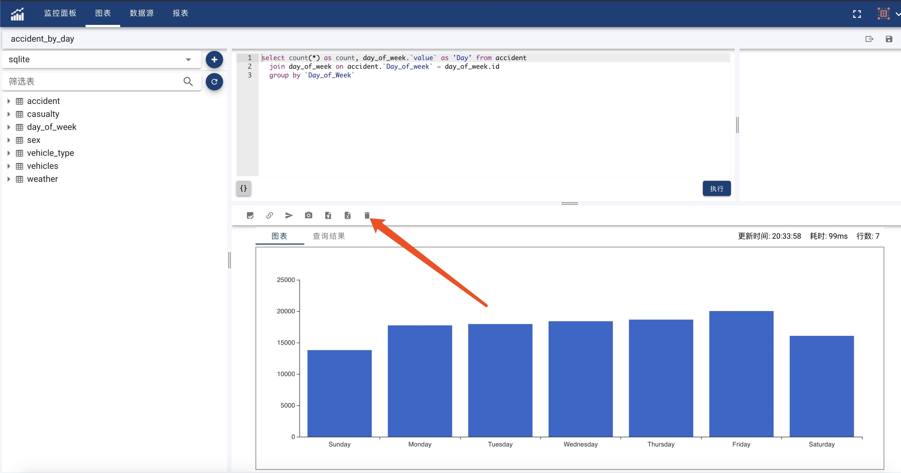

#### 可视化
- 数据映射

点击添加图表按钮之后，进入图表向导。向导的第一步为数据映射。

在该步骤，选择图表所需的所有数据列，可能的话，完成数据格式的转化。默认查询结果的所有列都是字符串。在该步骤完成数据的格式化。例如转换为数字格式/时间格式。数据格式见[格式化](format)

- 选择图表类型

完成数据映射之后，点击下一步进入图表类型的选择。选择可视化图表类型。

- 图表设置

选择好图表类型之后，进入图表设置编辑页面。该页面根据选择的图表类型不同会有很大的不同。该页面分为两部分，左边为设置区，右边为预览区。请根据选择的不同，进行不同的设置。

完成上面步骤之后，点击保存，则完成了图表的创建。完成之后会返回图表编辑页面。在图表区，您将看到创建的图表。

#### 修改可视化类型
进入图表的编辑界面，如果该图表尚未设置可视化，点击图表区中间的按钮进入图表可视化向导，设置可视化类型。如果图表已经设置过可视化，点击图表上面工具栏中的删除按钮，删除可视化设置,如下图所示:

重新进入可视化向导，改变可视化类型。